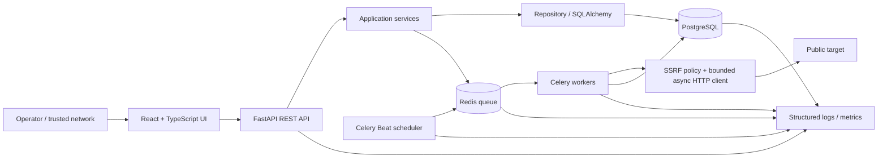

# System Architecture

**Product:** Automated Multi-Project API Attack Surface Discovery & Security Monitoring Platform  
**Authority:** Read with `PRD.md` for scope, `Rules.md` for normative state/safety logic, and `Design.md` for UI behavior.  
**Implementation status:** **IMPLEMENTATION-UNVERIFIED**; this is a specification-grounded blueprint, not a repository audit.

## 1. Architectural decisions

1. Use a modular monolith for the REST API and service/domain layer, plus separate scheduler and worker processes from the same Python codebase. This keeps deployment simple while ensuring discovery and checks do not block API requests.
2. Frontend: React + TypeScript. Backend: Python + FastAPI + async HTTP client. Persistence: PostgreSQL. Queue: Redis with Celery workers and Celery Beat scheduler (or a compatible single selected Celery topology; do not add a second queue system). Compose is the initial deployment unit.
3. API request handlers validate input, call services, and return quickly. Long tasks are persisted and enqueued; workers own network I/O and result persistence. PostgreSQL is the source of truth; Redis messages are transient delivery, not canonical records.
4. Every target fetch passes through a single SSRF-safe outbound client/policy. Discovery, verification, browser interception, and monitoring may not use independent unrestricted HTTP clients.
5. Default scope is one project origin; no login, identity, auth middleware, or tenant/user model. Restrict the unauthenticated API/UI to a trusted network.
6. Public discovery is bounded and best-effort. OpenAPI, constrained crawler, and JS parsing are baseline providers. Browser/network provider is advanced, optional, disabled by default.

## 2. Context and component diagram



**Runtime processes:** `api`, `scheduler`, `worker`, `postgres`, `redis`, and `frontend` (static development/production serving as selected). A separate browser worker/container is started only if browser discovery is enabled. Prometheus/Grafana are optional Compose profiles for local observability; the app must still run without them.

## 3. Component responsibilities

| Component | Responsibilities | Must not do |
|---|---|---|
| React UI | Render API data; submit validated actions; poll persisted job state; show loading/empty/error states | Calculate authoritative health, invent metrics/progress, make target requests |
| FastAPI routers | Schema validation, pagination, response codes, invoke services; enqueue work | Perform crawling/checks synchronously |
| Application services | Project lifecycle, discovery orchestration, monitoring control, analytics queries, incident/alert rules | Bypass repository or outbound policy |
| Repository/data layer | Transactional reads/writes, project scoping, migrations | Embed product policy in ad hoc UI-dependent SQL |
| Discovery manager | Create run, invoke provider adapters, normalize candidates, store evidence/snapshot/comparison | Claim exhaustive coverage or call unsafe methods |
| Providers | OpenAPI parser; same-origin crawler; JS text analyzer; optional isolated browser/network capture | Persist canonical endpoint identity independently or bypass safety gates |
| Scheduler | Find due enabled/unpaused configs; enqueue idempotent scheduled jobs; update scheduling metadata | Make outbound HTTP requests or treat Redis as schedule truth |
| Redis/Celery | Deliver bounded task payloads and retries | Store canonical check/run/incident state |
| Workers | Execute discovery/check tasks; persist results; invoke health/incident/alert services | Accept unvalidated arbitrary destination URLs from queue payloads |
| Safe outbound client | URL/host/IP validation, DNS/IP pinning, redirect revalidation, rate/concurrency/resource limits, safe method execution | Follow internal or unvalidated redirects |
| PostgreSQL | Canonical domain data and history | Store secrets/response bodies by default |
| Observability | Low-cardinality metrics, redacted structured logs, dependency health | Expose targets/full URLs/request IDs as metric labels |

## 4. Backend module boundaries

Suggested package structure (names are implementation guidance, not a requirement to mirror exactly):

- `api/v1`: routers, request/response schemas, exception mapping.
- `services`: project, discovery, endpoint, monitoring, analytics, incident, alert, system health use cases.
- `domain`: enums, canonicalization, health/incident/alert/snapshot rules.
- `repositories`: PostgreSQL access and transaction boundaries.
- `discovery/providers`: `openapi`, `crawler`, `javascript`, optional `browser`.
- `network`: URL policy, DNS resolver, pinned transport, redirect handler, per-origin limiter.
- `workers`: discovery/check task entry points and retry policy.
- `scheduler`: due-task query and queue handoff.
- `observability`: logging, metrics, tracing hooks.

Use async database access where useful. Keep network work in workers, not request handlers. Transactionally persist outcome and derived state/event updates so a committed check cannot exist without its associated health/incident evaluation being retried or recoverable.

## 5. Discovery architecture and flow

```mermaid
sequenceDiagram
  actor Operator
  participant UI
  participant API as FastAPI
  participant DB as PostgreSQL
  participant Q as Redis
  participant W as Discovery worker
  participant P as Providers + safe client
  Operator->>UI: Add project / Start discovery
  UI->>API: POST /projects, POST /projects/{id}/discovery-runs
  API->>API: Validate URL and policy
  API->>DB: Persist project/run QUEUED
  API->>Q: Enqueue run_id (after DB commit/outbox-safe handoff)
  API-->>UI: 202 + run_id
  W->>DB: Claim run, mark RUNNING
  W->>P: OpenAPI → crawl → JS → optional browser
  P->>P: Validate before every request; enforce limits
  P-->>W: Candidate observations + provider errors
  W->>W: Normalize, deduplicate, safe verification
  W->>DB: Upsert endpoints/sources; persist run snapshot; compare prior completed snapshot
  W->>DB: Persist counts, status, completion
  UI->>API: GET discovery run/poll
  API-->>UI: Actual persisted progress/results
```

Provider order is a default, not a correctness dependency. Each provider returns `CandidateObservation` with raw reference, source enum, observed method(s), base URL, confidence evidence, and non-sensitive provider metadata. Manager canonicalizes and deduplicates before verification. Errors are per-provider and do not erase successful provider findings. A run ends `COMPLETED`, `PARTIAL`, or `FAILED`; partial means at least one provider returned usable findings but one or more providers failed/skipped. Cancellation can be future scope unless implemented with durable semantics.

### Providers

- **OpenAPI:** Probe allowlisted common documentation paths relative to project origin. Parse within body/time limits. Resolve relative server/path references. Reject unsafe/external targets from fetching by default; record out-of-scope references as provider observations only if useful, never as verified endpoint.
- **Crawler:** GET only, same-origin, depth/page budget, content-type and body limit. Parse anchors/resources; prioritize API-like routes/docs; avoid form submission and unbounded query variation.
- **JavaScript:** Fetch same-origin JS assets only. Parse text for static URL/path and method patterns (`fetch`, axios, XHR, recognizable literal forms). Static parse is not execution and produces candidates only.
- **Browser:** Optional adapter, isolated container, no host network/local files/secrets, same-origin navigation and request capture by default, request/response/body limits, runtime/page caps. It records observed network requests as candidates; no guarantee of complete dynamic coverage.

## 6. Monitoring and scheduling architecture

```mermaid
sequenceDiagram
  participant Beat as Celery Beat / scheduler
  participant DB as PostgreSQL
  participant Q as Redis
  participant W as Monitoring worker
  participant N as Safe HTTP client
  participant T as Target endpoint
  participant S as Health/incident/alert services
  Beat->>DB: Select due enabled, unpaused safe configs
  Beat->>Q: Enqueue idempotent check(endpoint_id, origin, due_at)
  W->>DB: Revalidate config/project/endpoint; claim check
  W->>N: Execute safe GET/HEAD with timeout/body cap
  N->>N: DNS/IP validation, pin, revalidate redirects
  N->>T: HTTP request
  T-->>N: Status/headers/body-limited response
  N-->>W: Result or normalized failure
  W->>DB: Persist monitoring_result
  W->>S: Evaluate state, metrics basis, incidents, alerts
  S->>DB: Persist state transitions/events/alerts transactionally
```

Celery Beat may poll due configurations at a short fixed cadence (e.g., every 5 seconds) and select rows using indexed `next_check_at`; it enqueues only due items and advances due time under a row lock or optimistic version to prevent duplicate dispatch. Configs are due from PostgreSQL, not Redis. Celery retries are limited and task IDs/idempotency keys include endpoint, due time, and check origin. Manual Check Now uses the same worker path with origin `MANUAL` and rate limits, and does not alter the scheduled `next_check_at` unless explicitly defined by service policy (default: no).

Worker checks execute only configured supported safe method; endpoint method identity may document unsafe operations, but such endpoints remain unmonitorable automatically. For an HTTP target response, record final status and timing; for policy rejection or transport failure, record normalized failure without leaking internal detail. One check's result is committed with health evaluation and emitted state events; if downstream event handling fails, retry/reconciliation must not duplicate incidents/alerts.

## 7. Database architecture

Use PostgreSQL migrations, UUID primary keys, UTC `timestamptz`, explicit enums or checked text statuses, and foreign keys with deliberate cascade/restrict behavior. Store JSONB only for bounded evidence/config payloads that are not stable relational dimensions. Never use a JSON blob instead of queryable fields needed for analytics/filtering.

| Table | Purpose and key fields | Key indexes/constraints |
|---|---|---|
| `projects` | `id`, `name`, `start_url`, `origin`, `status`, `created_at`, `updated_at` | Unique normalized origin unless product explicitly permits duplicates; status index |
| `endpoints` | `id`, `project_id`, `canonical_key`, `method`, `normalized_url`, `path`, `verification_status`, confidence, first/last-seen, health, timestamps | Unique `(project_id, canonical_key)`; `(project_id, health)`; project FK |
| `endpoint_sources` | `endpoint_id`, source enum, first/last-seen, evidence JSONB bounded | PK `(endpoint_id, source)` |
| `discovery_runs` | `id`, `project_id`, state, start/finish, provider states/progress, counts, errors summary, trigger | `(project_id, started_at desc)`, state index |
| `discovery_snapshot_items` | `run_id`, `endpoint_id` nullable for removed historic endpoint, canonical key, captured method/URL/evidence/version hash | Unique `(run_id, canonical_key)`; run FK; preserve tombstone fields |
| `discovery_changes` | `run_id`, canonical key, change enum, endpoint refs, before/after JSONB bounded | `(run_id, change_type)` |
| `monitoring_configs` | `endpoint_id` unique, enabled, paused, interval seconds, timeout, expected status policy, failure/latency thresholds, last/next schedule, version | Partial due index where enabled and not paused; interval check |
| `monitoring_results` | `id`, endpoint/config FK, checked_at, origin, method, status, latency_ms, success, timeout, error_type, bytes, content_type | `(endpoint_id, checked_at desc)`; retention/partitioning later if volume demands |
| `incidents` | `id`, project/endpoint FK, condition key, severity, status, description, start/resolve, last event | Unique partial active `(endpoint_id, condition_key)`; project/status/start index |
| `incident_events` | `id`, incident FK, event type, from/to status, timestamp, metadata | `(incident_id, created_at)` |
| `alerts` | `id`, project, optional endpoint/run/incident refs, type, severity, dedupe key, state, first/last occurrence, count, cooldown_until | `(project_id, created_at desc)`, dedupe key/status indexes |
| `system_health_checks` (optional) | component, checked_at, status, safe details/latency | `(component, checked_at desc)`; do not persist secrets |

Snapshot item stores canonical key and compared fields so removed endpoints remain comparable even if an endpoint row is later retired. Endpoint rows should be soft-retired (`retired_at`) rather than hard-deleted while referenced by checks/incidents/snapshots. Project delete is restricted or explicit archival/cascade operation with warning and transactional lifecycle policy.

`monitoring_results` volume can grow quickly. Initial implementation may index and apply configurable retention only if retention policy is exposed and never deletes incident/snapshot evidence silently. Partitioning/rollups are future scale options. Analytics query raw rows for the selected period; later rollups must be exactly reconciled to raw definitions.

## 8. REST API architecture

Base path `/api/v1`. JSON request/response; UUID IDs; timestamps ISO-8601 UTC. Standard error envelope: `{ "error": { "code": "...", "message": "...", "details": {}, "request_id": "..." } }`. Never return resolver internals or raw stack traces. List endpoints use `limit`/`cursor` or `limit`/`offset`, cap page size; time-series requires supported bounded `period`.

| Method and route | Functionality |
|---|---|
| `GET /health/live`, `GET /health/ready` | Process liveness; dependency readiness, respectively |
| `GET /api/v1/system/health` | Actual component statuses and last observed time |
| `GET/POST /api/v1/projects` | List/create project; create validates public URL and returns `201` |
| `GET/PATCH/DELETE /api/v1/projects/{project_id}` | Details/update name or archive; no arbitrary URL mutation without a new discovery policy |
| `POST /api/v1/projects/{project_id}/discovery-runs` | Start run; `202` with run ID |
| `GET /api/v1/projects/{project_id}/discovery-runs` | Paginated history |
| `GET /api/v1/discovery-runs/{run_id}` | Real run state/progress/counts/errors |
| `GET /api/v1/discovery-runs/{run_id}/changes` | Snapshot comparison items and totals |
| `GET /api/v1/projects/{project_id}/endpoints` | Search/filter/paginate inventory |
| `GET /api/v1/endpoints/{endpoint_id}` | Endpoint state/config summary |
| `PATCH /api/v1/endpoints/{endpoint_id}/monitoring` | Configure allowed interval, enabled/paused, thresholds, safe timeout/status policy |
| `POST /api/v1/endpoints/{endpoint_id}/checks` | Enqueue Check Now; `202` with check/task reference |
| `GET /api/v1/endpoints/{endpoint_id}/checks` | Paginated recent check history |
| `GET /api/v1/endpoints/{endpoint_id}/analytics?period=...` | Real metrics, sample count and graph series |
| `GET /api/v1/projects/{project_id}/analytics?period=...` | Aggregated project analytics |
| `GET /api/v1/dashboard?period=...` | Multi-project KPI summaries, recent changes and incidents |
| `GET /api/v1/incidents`, `GET /api/v1/incidents/{id}` | Filtered incident list/detail |
| `PATCH /api/v1/incidents/{id}` | Allowed lifecycle transition / acknowledgement |
| `GET /api/v1/alerts`, `GET /api/v1/alerts/{id}` | Alert list/detail |
| `PATCH /api/v1/alerts/{id}` | Acknowledge/resolve in-product alert where applicable |
| `GET /api/v1/settings` | Effective configured defaults/limits; any writes are restricted to documented operator-safe settings |

No authentication routes, auth headers/tokens, or protected-route semantics. Apply CORS, request limits, rate limits, and trusted-network deployment guidance even without auth. Mutations use idempotency where retrying a client request could create duplicate runs/actions. Project association is enforced server-side, never trusted from a client-supplied foreign key.

## 9. Security architecture / SSRF controls

The outbound policy is mandatory for every external request, not only project creation.

1. Parse with a standards-compliant URL parser; accept only `http` or `https`; reject userinfo, malformed host/port, control characters, unsupported IP literal forms, and non-default ports only if deployment policy requires (default: allow valid public ports under egress policy).
2. Normalize IDNA hostname and resolve A/AAAA records. Reject if any resolved address is loopback, private, link-local, unspecified, multicast, reserved, IPv4-mapped unsafe IPv6, or otherwise non-public. Block known cloud metadata names/addresses including link-local metadata endpoints.
3. Connect to a validated resolved IP while preserving the validated hostname for TLS SNI/Host; prevent a second unvalidated resolution in transport. Revalidate resolution/address binding at connection time and on DNS refresh. Fail closed on mixed safe/unsafe answers or DNS changes inconsistent with the pin.
4. Disable automatic redirect following. For each redirect, cap hops, resolve relative Location, re-run full URL/DNS/origin policy, and reject unsafe or scope-escaping targets. Record a sanitized policy failure.
5. Apply per-request connect/read/total deadlines, response header/body caps, decompression caps, method allowlist (GET/HEAD for automated probe/check), TLS certificate verification, per-host token bucket, per-project/global semaphore, and worker execution cap.
6. Browser worker egress is isolated with deny-by-default network policy; intercept and gate each request. No access to Docker socket, host files, credentials, internal service DNS, or cloud metadata. Browser requests cannot bypass the shared policy.
7. API SSRF control plane is also protected from abuse by body/schema limits, CORS allowlist, deployment network restriction, project creation/discovery/check rate limits, and safe errors. No auth is added in this version.

DNS pinning implementation details must be verified against the selected async HTTP transport: the transport must connect to the pinned address while retaining hostname verification and must not silently re-resolve. Unit and integration tests must cover DNS rebinding and redirect-to-private cases.

## 10. Failure handling and consistency

- Persist `QUEUED` state before enqueue; use transactional outbox or an idempotent recovery poller so a committed task cannot be permanently lost if Redis enqueue fails.
- Queue unavailable: API returns retryable service error for new actions; existing run/check remains `QUEUED`/`RETRYING` and visible. Scheduler health reports degraded.
- Worker crash: bounded Celery retry for transient transport/DB/Redis failures; no retries for permanent policy rejection or invalid response. Ensure task idempotence by unique run/check idempotency keys.
- Target failure is a monitoring result, not a system exception. Store normalized `timeout`, `dns_error`, `connection_error`, `tls_error`, `http_status`, `response_too_large`, or `policy_blocked` categories as applicable.
- Discovery provider failure is recorded independently and does not discard other provider results. A run with no successful provider is `FAILED`; partial provider success is `PARTIAL`.
- DB transaction failure must not display unpersisted health/incident state. Retry/reconcile safely; dashboard reads canonical committed data.
- Redis, DB, scheduler, or worker unavailable is reflected by actual readiness/system health response; do not infer worker health solely from process startup.

## 11. Observability, deployment, and scaling

**Structured logs:** timestamp, level, component, event, run/check IDs, project/endpoint IDs where access-controlled locally, correlation ID, normalized outcome; redact query strings, fragments, credentials, and sensitive headers. Avoid logging full response bodies.

**Metrics (low cardinality):** check total/failure by outcome class and origin; check latency histogram; endpoint health counts by state (not endpoint ID); discovery duration/provider/outcome; candidates/verified counts; incidents opened/resolved; alert emissions/suppressed; queue depth/oldest age; worker active/retry counts; scheduler lag; DB/Redis dependency state. Do not label by full URL, project/user/request ID, or endpoint ID.

**Tracing:** optional OpenTelemetry spans for API request → enqueue → worker → database/outbound request; propagate trace context where available without using IDs as metric labels.

**Compose:** persistent volumes for PostgreSQL; Redis persistence is not canonical and may be ephemeral; readiness checks and dependency ordering; internal-only DB/Redis networks; configurable egress, CORS, safety limits, and secrets for DB service credentials. Never publish PostgreSQL/Redis ports by default. Prometheus/Grafana may be an optional profile. Do not include Kubernetes as a release dependency.

**Scaling:** First scale worker replicas while preserving per-origin rate/concurrency limits. Use DB indexes and bounded analytics windows. Avoid premature microservices. If check volume requires, add retention/partitioning and rollups as measured follow-up; queue and scheduler remain decoupled from HTTP API.
