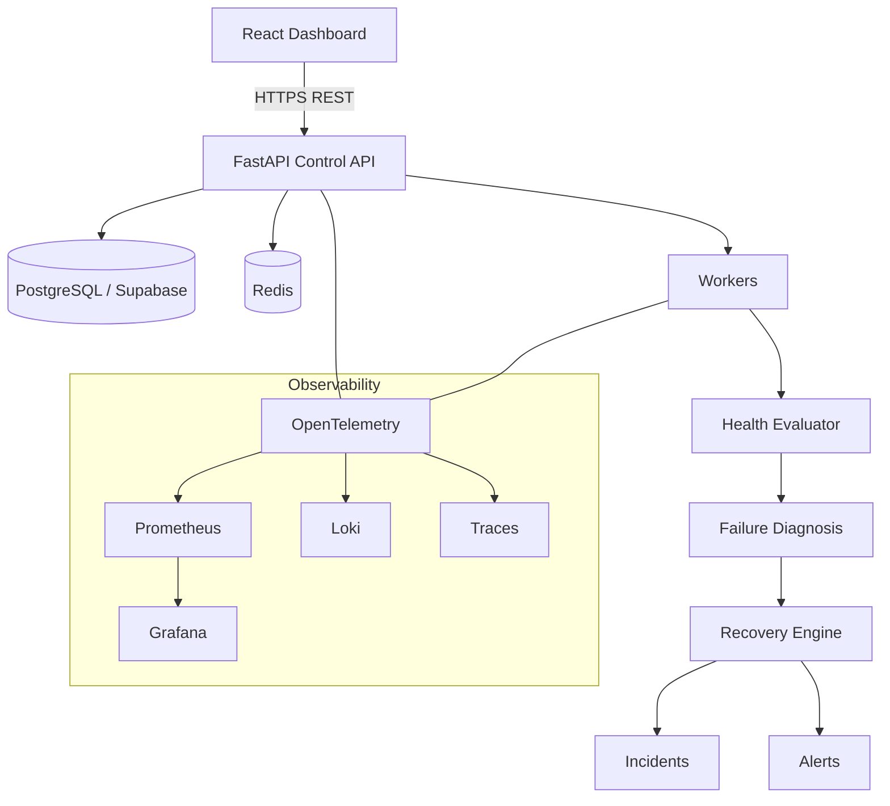

# Self-Healing API Reliability Platform — Implementation Plan

## Problem Statement

Build a **production-oriented Self-Healing API Reliability Platform with Intelligent User-Specific Caching**. This is not a monitoring dashboard — it is a complete reliability workflow engine that observes, detects, diagnoses, degrades gracefully, recovers, verifies, and records incidents, driven by deterministic policy rather than AI/ML.

---

## User Review Required

> [!IMPORTANT]
> **Supabase Connection**: The project uses Supabase PostgreSQL as the managed database. You will need to provide a Supabase project URL and anon/service-role key (or a PostgreSQL connection string) in the `.env` file. I will generate `.env.example` with all required variables clearly documented.

> [!IMPORTANT]
> **Phased Build**: Per the prompt, this will be built **phase by phase** (16 phases total). I will implement Phase 1 first, validate it runs, then proceed to subsequent phases in subsequent turns. This avoids shipping thousands of unvalidated lines at once.

> [!WARNING]
> **No AI/ML**: The self-healing logic is entirely deterministic — state machines, thresholds, circuit breakers, retry policies, and allowlisted recovery actions. No LLM calls will be added.

> [!CAUTION]
> **Failure injection endpoints** will be gated behind a `DEVELOPMENT_MODE=true` environment flag and require `ADMIN` role. They will not be reachable in production configuration.

---

## Open Questions

> [!IMPORTANT]
> **Do you have a Supabase project already?** If yes, please share the connection string. If no, the Docker Compose file will include a local PostgreSQL container for development, and the architecture will stay Supabase-compatible for production.

> [!IMPORTANT]
> **Frontend hosting preference**: Should the React frontend be served from the same Docker Compose stack (Vite dev server in development, Nginx in production), or do you prefer a separate deployment target (Vercel, Netlify)?

> [!IMPORTANT]
> **Alert notification channels**: For Phase 12 (Alerting), the architecture will support webhook-based alerts (easy to connect to Slack/Discord/PagerDuty). Do you want a specific channel implemented now, or is the webhook + in-app approach sufficient for the initial build?

---

## Architecture Overview



---

## Phase-by-Phase Execution Plan

### ✅ Phase 1 — Foundation *(Starting Now)*

**Goal**: FastAPI starts, connects to PostgreSQL, health endpoints respond, authentication works, Alembic migrations run.

**Files to create:**

```
self-healing-api-platform/
├── backend/
│   ├── app/
│   │   ├── api/
│   │   │   └── v1/
│   │   │       ├── __init__.py
│   │   │       ├── auth.py          # login / token endpoints
│   │   │       └── system.py        # /health/live, /health/ready
│   │   ├── core/
│   │   │   ├── __init__.py
│   │   │   ├── config.py            # Pydantic Settings (all env vars)
│   │   │   ├── security.py          # JWT, password hashing, RBAC
│   │   │   ├── logging.py           # structlog setup
│   │   │   └── exceptions.py        # domain exception hierarchy
│   │   ├── middleware/
│   │   │   ├── __init__.py
│   │   │   ├── request_id.py        # inject/extract X-Request-ID
│   │   │   └── logging.py           # per-request structured log
│   │   ├── models/
│   │   │   ├── __init__.py
│   │   │   ├── base.py              # SQLAlchemy declarative base
│   │   │   └── user.py              # User model (id, email, role, hashed_password)
│   │   ├── schemas/
│   │   │   ├── __init__.py
│   │   │   ├── auth.py              # LoginRequest, TokenResponse, UserOut
│   │   │   └── common.py            # SuccessResponse, ErrorResponse
│   │   ├── repositories/
│   │   │   ├── __init__.py
│   │   │   └── user.py              # UserRepository
│   │   ├── services/
│   │   │   ├── __init__.py
│   │   │   └── auth.py              # AuthService (login, create_user, verify)
│   │   ├── db/
│   │   │   ├── __init__.py
│   │   │   └── session.py           # async SQLAlchemy engine + get_session dep
│   │   └── main.py                  # App factory, middleware, routers, exc handlers
│   ├── tests/
│   │   ├── conftest.py
│   │   └── api/
│   │       └── test_health.py
│   ├── migrations/
│   │   ├── env.py
│   │   └── versions/
│   ├── alembic.ini
│   ├── Dockerfile
│   ├── pyproject.toml
│   └── .env.example
├── docker-compose.yml
├── .gitignore
└── README.md
```

**Key design decisions for Phase 1:**

| Decision | Rationale |
|---|---|
| `structlog` for structured logging | JSON-native, async-safe, integrates with stdlib `logging` |
| `python-jose` + `passlib` for JWT/bcrypt | Industry standard for FastAPI auth |
| `asyncpg` driver via `SQLAlchemy[asyncio]` | Async-native PostgreSQL for FastAPI |
| `Pydantic Settings` for config | Type-safe, supports `.env` and environment injection |
| `X-Request-ID` middleware | UUID per request, propagated through all log lines |
| Centralized exception handlers on `app` | Never expose stack traces, always structured JSON errors |
| `VIEWER / OPERATOR / ADMIN` enum on User | Foundation for RBAC in later phases |
| Alembic with async engine | DB migrations that work with asyncpg |

**Exception hierarchy (Phase 1):**
```
AppBaseError
├── AuthenticationError
├── AuthorizationError
├── NotFoundError
├── ConflictError
├── DatabaseUnavailableError
├── DatabaseTimeoutError
└── DatabaseQueryError
```

More exception types (CacheUnavailableError, ExternalServiceError, etc.) added in later phases.

---

### Phase 2 — Endpoint Management

Create `endpoints` table, CRUD API (`/api/v1/endpoints`), schemas, repository, service. Operators can register monitored API endpoints with method, URL, thresholds, intervals.

---

### Phase 3 — Monitoring Worker

Async background worker (`APScheduler` or native `asyncio` tasks) that reads active endpoints, determines which checks are due, acquires Redis distributed locks, performs HTTP health checks with `httpx`, records results in `health_checks` table.

---

### Phase 4 — Health State Machine

`monitoring/states.py` — strict state transitions (`UNKNOWN → HEALTHY → DEGRADED → DOWN → RECOVERING → HEALTHY`). Rolling window evaluator using recent `health_checks`. Threshold-based (consecutive failures, error rate, latency P95).

---

### Phase 5 — React Dashboard

Vite + TypeScript + Tailwind CSS + TanStack Query. Dark-mode ops dashboard. Pages: Dashboard, Endpoints, Endpoint Detail, Incidents, Cache, Logs, Alerts, Settings.

---

### Phase 6 — Request Observability

`middleware/telemetry.py` — capture method, route template, status, latency, exception type, dependency, request_id per request. Prometheus metrics (histogram, counters) using route templates as labels (never user_id).

---

### Phase 7 — Redis Cache

`cache/` module — connection client, key builder (`user:{id}:{resource}:v{n}`), policy registry (CRITICAL/HIGH/MEDIUM/LOW priorities, TTL, max_stale), cache manager with user isolation, TTL, versioning.

---

### Phase 8 — Graceful Degradation

`cache/fallback.py` — when primary dependency fails, look up user-specific cache, evaluate freshness against policy, return `{"status":"degraded","source":"cache","stale":true,...}` or 503 with clear error if no usable cache.

---

### Phase 9 — Diagnosis Engine

`monitoring/diagnosis.py` — deterministic rule engine. Combines HTTP status, exception type, dependency health, recent failure frequency. Outputs `FailureClassification` enum.

---

### Phase 10 — Incident Management

`incidents/` module — lifecycle manager, deduplication (one active incident per endpoint per failure type), timeline events, CRUD API. State machine: `DETECTED → INVESTIGATING → RECOVERING → VERIFIED → RESOLVED` (or `ESCALATED`).

---

### Phase 11 — Recovery Engine

`recovery/` module — policy registry keyed on `FailureClassification`, exponential backoff (configurable max_attempts/delay/jitter), circuit breaker (CLOSED/OPEN/HALF_OPEN stored in Redis), verification step before marking HEALTHY, max-attempt escalation.

---

### Phase 12 — Alerting

`alerts/` module — rule engine, deduplication by (rule, endpoint, cooldown), severity levels, webhook notifier. Architecture allows adding Slack/PagerDuty adapters without touching the core.

---

### Phase 13 — Full Observability

Add `prometheus-client`, `opentelemetry-sdk`, Loki log shipping via `python-logging-loki` or Promtail sidecar. Grafana dashboard JSON exported to `infrastructure/monitoring/grafana/`.

---

### Phase 14 — Docker

`Dockerfile` for backend and frontend. `docker-compose.yml` with health checks (not just `depends_on`) for: FastAPI, React, Redis, Monitoring Worker, Prometheus, Grafana, Loki, (optionally local PostgreSQL for dev).

---

### Phase 15 — Failure Testing

`tests/failure_scenarios/` — controlled failure injection tests exercising all 5 required demo scenarios. Failure injection endpoints (`/api/v1/dev/inject/*`) behind `DEVELOPMENT_MODE` flag and `ADMIN` role.

---

### Phase 16 — Kubernetes

Kubernetes manifests in `infrastructure/kubernetes/` — Deployments, Services, ConfigMaps, Secrets, HPA, PodDisruptionBudgets. Only after Docker/local is validated.

---

## Technology Decisions

| Technology | Role | Why |
|---|---|---|
| FastAPI | HTTP API + control plane | Async, typed, auto-docs |
| Pydantic v2 | Schemas + config | Fast validation |
| SQLAlchemy 2.x async | ORM | Async-native, type-safe |
| Alembic | DB migrations | Production-safe schema changes |
| PostgreSQL (Supabase) | Persistent truth | Managed, reliable |
| Redis | Runtime cache + locks + CB state | Sub-ms, TTL-native |
| structlog | Structured logging | JSON-native, context-propagating |
| httpx | Async HTTP client | Used for health checks + external calls |
| APScheduler or asyncio tasks | Background workers | Async-native scheduling |
| prometheus-client | Metrics | Standard scrape target for Grafana |
| opentelemetry-sdk | Distributed tracing | Vendor-neutral |
| Vite + React + TypeScript | Frontend | Fast dev, typed |
| TanStack Query | Data fetching/cache | Automatic refetch, loading states |
| Tailwind CSS | Styling | Utility-first, dark mode |
| Recharts | Charts | React-native, responsive |
| Docker Compose | Local dev orchestration | Reproducible |
| GitHub Actions | CI/CD | Lint, test, build, security |

---

## Verification Plan

### After Phase 1
- `pytest tests/api/test_health.py` — liveness and readiness endpoints return 200
- `pytest tests/api/test_auth.py` — login returns JWT, bad credentials return 401
- `alembic upgrade head` runs without error
- FastAPI starts with `uvicorn app.main:app`
- All structured log output is valid JSON
- No stack traces leak to HTTP responses

### After Each Subsequent Phase
- Targeted tests for that phase's features
- Full `pytest` suite must remain green
- Docker Compose stack comes up cleanly

---

## Notes on Scope Control

This prompt describes 16 phases of a production system. I will:
1. Implement exactly one phase per turn
2. Validate before proceeding
3. Not generate placeholder/stub code that doesn't actually work
4. Fix any errors before moving forward
5. Update `task.md` throughout execution
